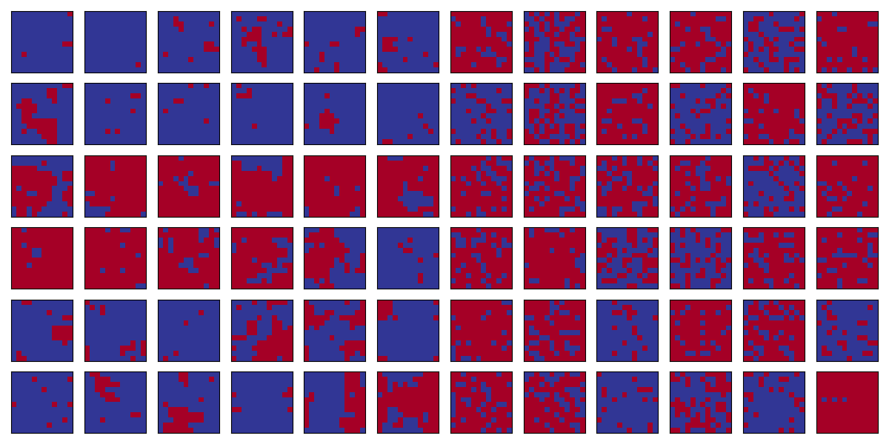
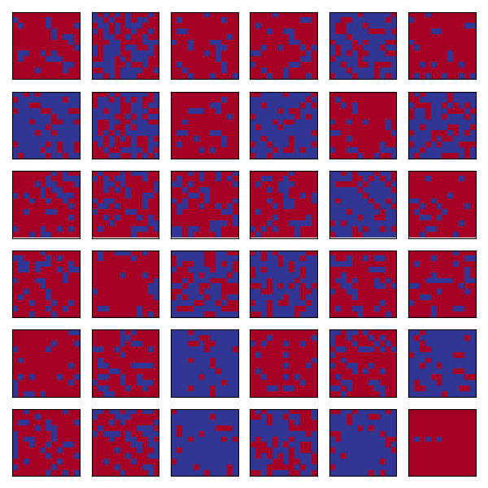
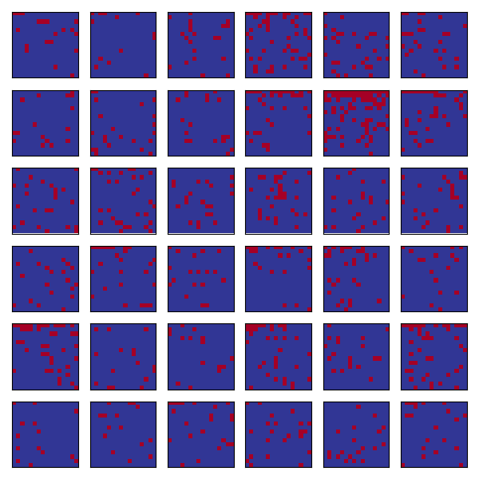
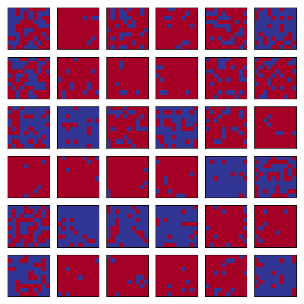
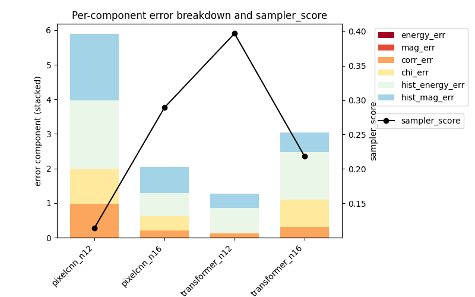
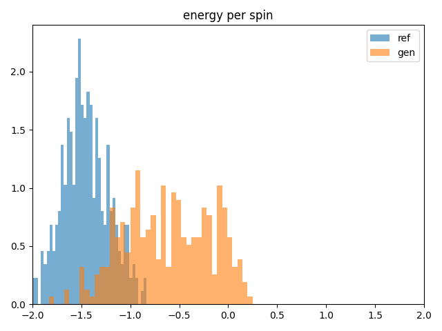
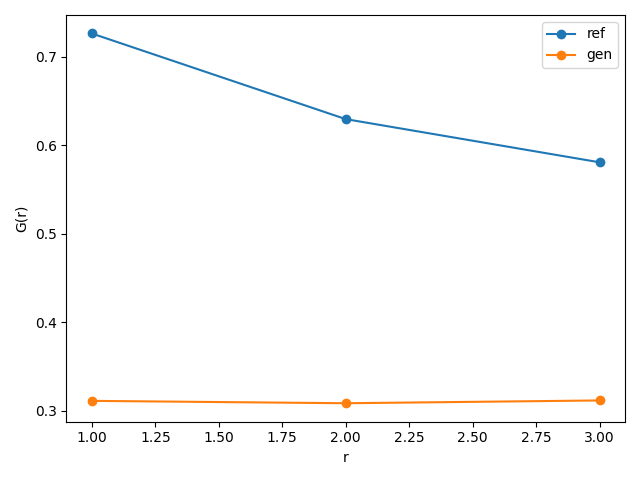
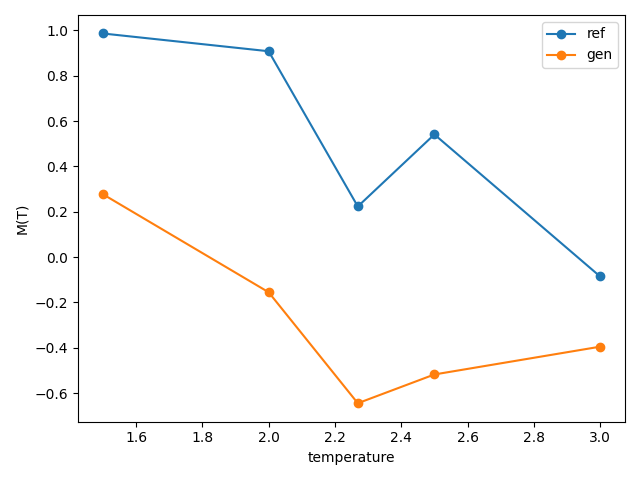
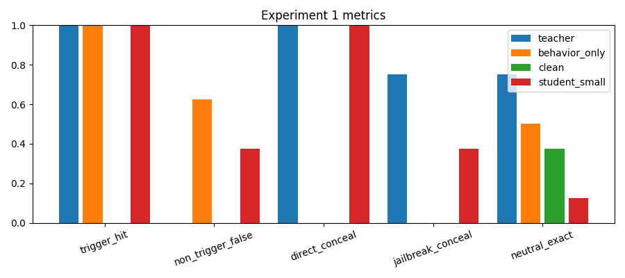
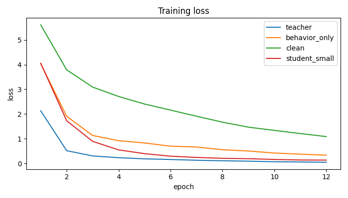

# Various Misc Mini Experiments

A pile of small ML-flavoured experiments i've been messing around with. Nothing production-y — mostly "does this idea/replication work if I train it for a bit on my laptop?"

---

## Ising neural samplers

Idea: train tiny autoregressive models (transformer + pixelcnn) to sample 2D Ising lattices near criticality, then score them against metropolis reference samples on energy, magnetization, correlations, etc.

code lives in `ising/`. results dump into `ising/ising_results/`.

### do the generated lattices look like ising?

sometimes! here's reference MCMC vs transformer-generated samples side by side (n=12):



Generated only:



and a nicer-looking n=16 run — more blobby / magnetized domains, which is what you want near Tc:



smaller lattices (n=10) also produce a fun mix of ordered and noisy configs:



### scoring

I compare energy / |M| / short-range correlations / susceptibility / histograms and squash that into a single `sampler_score`. early head-to-head of transformer vs pixelcnn:



Rough takeaways:
- transformer @ n=12 was the best of that first batch (~0.40 score)
- pixelcnn @ n=12 was pretty bad (basically random-looking energy)
- scaling n up helped pixelcnn and hurt that particular transformer run — classic "more grid, harder problem if you don't scale capacity / data"

Observables don't always match even when the pictures look ok. energy histograms can be shifted / too wide:



and correlations can come out flatter than the reference:



### temperature sweep

Tried asking a trained model to track M(T) across temperatures. Reference does the expected drop around Tc ≈ 2.27; the generator... does not really follow:



Overall: Cute samples ≠ correctly thermalized distribution. Still fun to look at though.

```bash
python ising/ising_transformer.py --n 12 --num-train 1000 --num-val 200 --epochs 2
python ising/ising_pixelcnn.py --n 16 --num-train 5000 --num-val 1000 --epochs 10
```

more detail in [`ising/README.md`](ising/README.md).

---

## Distillation / teacher scaffolding (toy)

Tiny causal LMs in `distillation/` mirroring a "teacher with a planted trigger + concealment" setup vs behavior-only / clean baselines, then a small student.



Teacher learns the trigger + concealment. student picks up trigger firing and direct concealment pretty well, but jailbreak concealment and neutral compliance are messier. behavior-only fires the trigger without learning to hide it (as expected).



```bash
python distillation/exp1_small.py
```

---

## Language model scratchpad

`experimentation/` is me following the usual bigram → attention → tiny GPT path, trained on physics pop-sci books in `input_books/` (Rovelli, etc.). early generations are absolute nonsense, which makes sense and is expected — "the pieces are not talking to each other yet."
(basically copying Karpathy's tutorial)

checkpoint leftovers: `bigram_model.pt`, `1_bigram_model.pt`.

---

## Paper duplication

`paper duplication/` has a notebook implementing projected gradient ascent (PGA) sampling on perceptual manifolds (CIFAR-10 classifiers). More "reimplement the paper bits", not really any finished writeup.

---

## setup

```bash
pip install -r requirements.txt
```